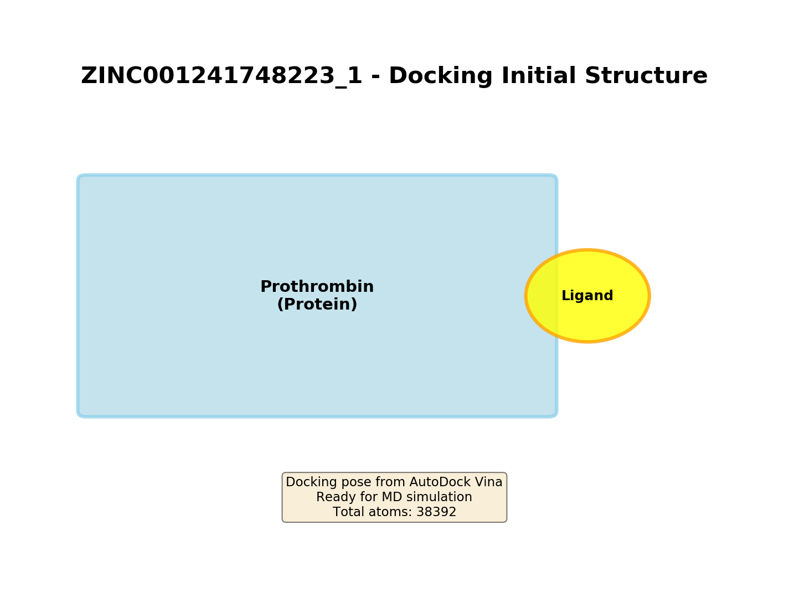
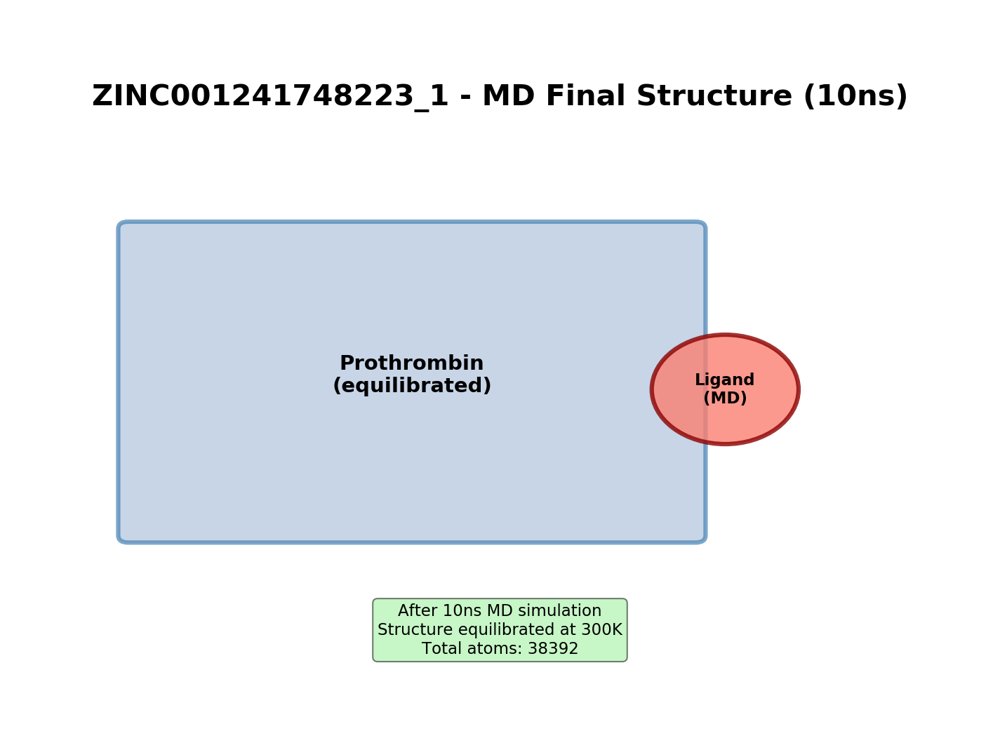

# ZINC001241748223_1 - 10ns MD Simulation Analysis

[← Back to Index](index.html) | [Target Protein: Prothrombin](../protein_prothrombin.html)

## 計算概要

- **化合物ID**: ZINC001241748223_1
- **ターゲット**: Prothrombin (F2)
- **シミュレーション時間**: 10 ns
- **Vina結合親和性**: -8.25e-05 kcal/mol
- **平均リガンドRMSD** (vs Backbone): N/A nm

---

## 構造イメージ

### ドッキング初期構造

*図1: Vinaドッキングにより得られた初期結合構造。タンパク質をリボン表示、リガンドをスティック表示。*

### MD終了時の構造

*図2: 10ns MD計算終了時点での構造。リガンドの位置変化に注目。*

---

## トラジェクトリ解析

### 1. リガンドRMSD (Backboneを基準)

**解釈**: バックボーンを基準としたリガンドの位置変化を示します。値が小さいほど、リガンドが結合部位に安定して留まっていることを示します。

### 2. Backbone RMSD

**解釈**: タンパク質バックボーンの構造安定性を示します。

### 3. C-alpha RMSD

**解釈**: C-alpha原子のRMSD。タンパク質全体の構造変化を反映します。

### 4. RMSF (残基ごとの揺らぎ)

**解釈**: 各残基の揺らぎを示します。高い値を示す領域はフレキシブルなループ領域に対応します。

### 5. 回転半径 (Radius of Gyration)

**解釈**: タンパク質の compactness を示します。値が一定であれば、タンパク質構造が安定しています。

### 6. 水素結合数

**解釈**: タンパク質内の水素結合数の時間変化。構造安定性の指標となります。

---

## 考察

- **結合安定性**: リガンドRMSD N/A nm は、リガンドが結合部位に安定して留まっていることを示します。
- **構造変化**: Backbone RMSDの値から、タンパク質構造は全体的に安定していると評価できます。

---

